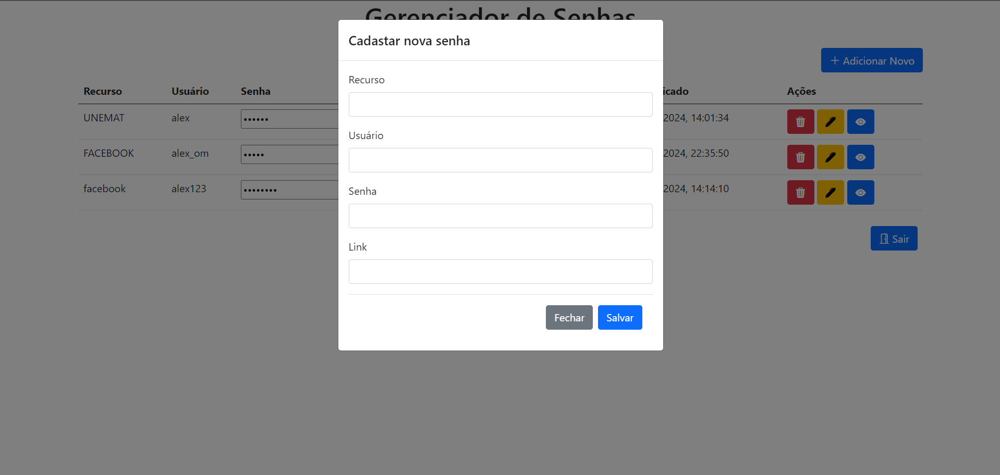

# Projeto Chavemestra.

## Descrição

- Este projeto é uma aplicação Node.js utilizando Express, gerenciamento de sessões e banco de dados MySQL para criar e guardar suas senhas em segurança.

### Pré-requisitos

- Node.js instalado (versão 14.x ou superior)
- MySQL instalado e rodando

## Instalação

- Siga os passos abaixo para configurar e executar o projeto em sua máquina local:
## 1. Clone o repositório:
```sh
git clone https://github.com/riccileonardo/Trabalho_Desenvolvimento_Web.git
cd projeto
```

## 2. Instale as dependências:
```sh
npm install sendgrid/mail
npm install bcrypt
npm install dotenv
npm install express
npm install express-session
npm install google-auth-library
npm install nodemailer
npm install mysql
```

## 3. Configuração do banco de dados:

- Este projeto utiliza um banco de dados chamado `chavemestra` com três tabelas principais: `usuarios`, `senhas` e `google_users`.

- A tabela `google_users` armazena informações de usuários que fizeram login atravéz do Google.
- A tabela `senhas` armazena senhas de usuários para diferentes recursos.
- A tabela `usuarios` armazena informações básicas de usuários, incluindo senhas criptografadas que se cadastraram através do sistema.

- Para configuração do banco de dados, execute o script do arquivo [scriptdb.sql](scriptdb.sql) em seu MySQL Workbench, Logo após a criação do banco em sua máquina local, configure o arquivo [conexao.js](db/conexao.js) com os parâmetros necessários.

```javascript
const conexao = mysql.createConnection({
    host: 'seu-host',
    user: 'seu-usuario',
    password: 'sua-senha',
    database: 'chavemestra'
});
```

## Rodando o Sistema:
Existem duas maneiras de iniciar o sistema: modo de produção e modo de desenvolvimento.

- Modo de Produção: Execute o seguinte comando **'npm start'**

- Modo desenvolvimento: Execute o seguinte comando **'npm run dev'**
  
Modo de Desenvolvimento é recomendável usar o Nodemon para reiniciar automaticamente
o servidor sempre que houver alterações no código.

O servidor estará acessível em http://localhost:9000 por padrão depois de iniciado.


## Dependências do front-end
A API utiliza as seguintes dependências:

- **Bootstrap**: Framework CSS para estilização.
- **jQuery**: Biblioteca JavaScript para manipulação de eventos e requisições AJAX.

## Imagens de Demonstração de telas do sistema
<p float="left">
    
    
    
    
    
    
</p>

## Autores
Esta API foi desenvolvida pelo grupo de modo geral.

Curso de Sistemas de Informação - UNEMAT.
